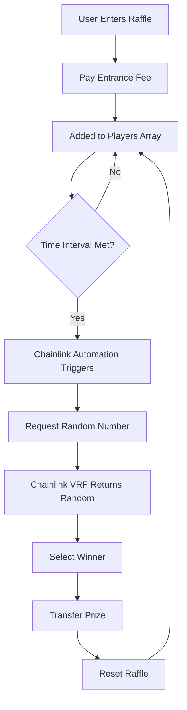

# 🎰 Decentralized Raffle Smart Contract

A provably fair, decentralized raffle system built on Ethereum using Chainlink VRF for verifiable randomness and Chainlink Automation for automated draws.

[](https://opensource.org/licenses/MIT)
[](https://soliditylang.org/)
[](https://getfoundry.sh/)

## 📋 Table of Contents

- [Overview](#overview)
- [Features](#features)
- [How It Works](#how-it-works)
- [Getting Started](#getting-started)
- [Usage](#usage)
- [Testing](#testing)
- [Deployment](#deployment)
- [Contract Addresses](#contract-addresses)
- [Security](#security)
- [Contributing](#contributing)
- [License](#license)

## 🔍 Overview

This smart contract implements a decentralized raffle system where:
- Users can enter by paying an entrance fee
- Winners are selected using Chainlink VRF for provably fair randomness
- Draws are automated using Chainlink Automation
- All funds go to the randomly selected winner

### Key Technologies
- **Chainlink VRF**: Provides verifiable random numbers for fair winner selection
- **Chainlink Automation**: Automatically triggers raffle draws at specified intervals
- **Solidity**: Smart contract development
- **Foundry**: Development framework and testing

## ✨ Features

- 🎲 **Provably Fair**: Uses Chainlink VRF for verifiable randomness
- ⚡ **Automated**: Chainlink Automation handles draw timing
- 🛡️ **Secure**: Follows CEI pattern and includes comprehensive security checks
- 🧪 **Well Tested**: Extensive unit and integration test coverage
- 🌐 **Multi-Network**: Deployable on multiple EVM chains
- 📊 **Gas Optimized**: Efficient contract design

## 🔄 How It Works

1. **Entry Phase**: Users pay entrance fee to join the raffle
2. **Open State**: Raffle accepts entries for a specified time interval
3. **Calculating State**: When interval expires, system requests random number
4. **Winner Selection**: Chainlink VRF provides random number to select winner
5. **Prize Distribution**: Winner automatically receives all collected funds
6. **Reset**: Raffle resets for next round



## 🚀 Getting Started

### Prerequisites

- [Git](https://git-scm.com/book/en/v2/Getting-Started-Installing-Git)
- [Foundry](https://getfoundry.sh/)

### Installation

1. Clone the repository:
```bash
git clone https://github.com/your-username/raffle-smart-contract.git
cd raffle-smart-contract
```

2. Install dependencies:
```bash
forge install
```


## 💻 Usage

### Local Development

1. **Start Anvil (Local Blockchain)**:
```bash
anvil
```

2. **Deploy Locally**:
```bash
forge script script/DeployRaffle.s.sol --rpc-url http://localhost:8545 --private-key $PRIVATE_KEY --broadcast
```

3. **Enter Raffle**:
```bash
cast send <RAFFLE_ADDRESS> "enterRaffle()" --value 0.01ether --rpc-url http://localhost:8545 --private-key $PRIVATE_KEY
```

### Contract Interaction

#### Enter the Raffle
```solidity
// Pay entrance fee to join
raffle.enterRaffle{value: entranceFee}();
```

#### Check Raffle State
```solidity
// Get current raffle state
RaffleState state = raffle.getRaffleState();

// Get recent winner
address winner = raffle.getRecentWinner();

// Get number of players
uint256 playerCount = raffle.getNumberOfPlayers();
```

## 🧪 Testing

### Run All Tests
```bash
forge test
```

### Test Coverage
```bash
forge coverage
```

### Test on Fork
```bash
forge test --fork-url $SEPOLIA_RPC_URL
```

### Specific Test Categories
```bash
# Unit tests only
forge test --mt test/unit/*

# Integration tests only  
forge test --mt test/integration/*

# Staging tests (on testnet)
forge test --mt test/staging/*
```

## 🚀 Deployment

### Testnet Deployment (Sepolia)
```bash
forge script script/DeployRaffle.s.sol --rpc-url $SEPOLIA_RPC_URL --private-key $PRIVATE_KEY --broadcast --verify
```

### Mainnet Deployment
```bash
forge script script/DeployRaffle.s.sol --rpc-url $MAINNET_RPC_URL --private-key $PRIVATE_KEY --broadcast --verify
```

### Post-Deployment Setup

1. **Fund VRF Subscription**:
```bash
forge script script/Interactions.s.sol:FundSubscription --rpc-url $SEPOLIA_RPC_URL --private-key $PRIVATE_KEY --broadcast
```

2. **Add Consumer**:
```bash
forge script script/Interactions.s.sol:AddConsumer --rpc-url $SEPOLIA_RPC_URL --private-key $PRIVATE_KEY --broadcast
```

### Known Issues
None currently identified.

## 📊 Gas Optimization

The contract is optimized for gas efficiency:
- Packed structs where possible
- Efficient storage patterns
- Optimized loops and conditionals

## 🤝 Contributing

Contributions are welcome! Please follow these steps:

1. Fork the repository
2. Create a feature branch: `git checkout -b feature/Smart-contract-lottery`
3. Make your changes and add tests
4. Run the test suite: `forge test`
5. Commit your changes: `git commit -m 'Add amazing feature'`
6. Push to branch: `git push origin feature/Smart-contract-lottery`
7. Open a Pull Request

### Development Guidelines
- Write comprehensive tests for new features
- Follow existing code style and patterns
- Update documentation as needed
- Ensure all tests pass before submitting PR

## 📄 License

This project is licensed under the MIT License - see the [LICENSE](LICENSE) file for details.

## 🙏 Acknowledgments

- [Chainlink](https://chain.link/) for VRF and Automation services
- [OpenZeppelin](https://openzeppelin.com/) for security standards
- [Foundry](https://getfoundry.sh/) development framework
- [Patrick Collins](https://github.com/PatrickAlphaC) for educational content

## Follow Me On Twitter


**⚠️ Disclaimer**: This contract is for educational/demonstration purposes. Use at your own risk in production environments. Always conduct thorough testing and audits before mainnet deployment.
